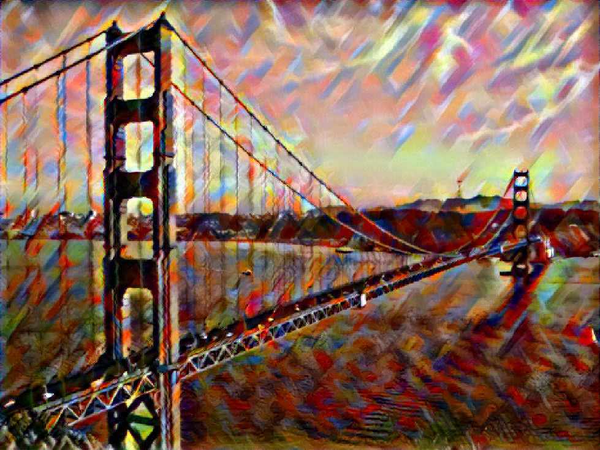

# Image Style Transfer using Convolutional Neural Network in PyTorch
---
This is unofficial pytorch implementation of a paper, "Image Style Transfer using Convolutional Neural Network" [Gatys+, CVPR2016].




## Requirements
---
* Python 3.5+ (tested with 3.5.4)
* PyTorch 0.2.0+ (tested with 0.3.0.post4)
* TorchVision 0.2.0+ (tested with 0.2.0)
* Numpy 1.11.1+ (tested with 1.13.3)
* Pillow 5.0.0+ (tested with 5.0.0)

## Usage
---
### Options
* `--content, -c`: The path to the content image.
* `--style, -s`: The path to the style image.
* `--epoch, -e`: The number of epoch. (Default: 300)
* `-content_weight, -c_w`: The weight of the content loss. (Default: 1)
* `-style_weight, -s_w`: The weight of the style loss. (Default: 1000)
* `--initialize_noise, -i_n`: If you use this option, the transferred image is initialized with white noise. If not, it is initialized with the grayscale content image.
* `--cuda`: If you have an available GPU, you should use this option.

### Examples
With CPU:
``` python
python style_transfer.py -c contents/golden_gate.jpg -s styles/kandinsky.jpg
```
With GPU:
``` python
python style_transfer.py -c contents/golden_gate.jpg -s styles/kandinsky.jpg --cuda
```

## Installation
---
```
git clone https://kenjienomoto@bitbucket.org/kenjienomoto/style_transfer_cvpr2016.git
```

### Docker
```
docker build -t style_transfer .
docker run -it style_transfer
```
### Nvidia Docker
```
nvidia-docker build -t style_transfer_gpu .
nvidia-docker run style_transfer_gpu
```
### Without Docker
Install PyTorch and dependencies from [http://pytorch.org.](http://pytorch.org)  
We have prepared requirement.txt, but it is preferable to use Anaconda as recommended by the official.

## References
---
* Leon A. Gatys, Alexander S. Ecker and Matthias Bethge. "Image Style Transfer Using Convolutional Neural Networks", in CVPR 2017. [[Paper]](https://www.cv-foundation.org/openaccess/content_cvpr_2016/papers/Gatys_Image_Style_Transfer_CVPR_2016_paper.pdf)
* Code is inspired by [Neural Transfer with PyTorch.](http://pytorch.org/tutorials/advanced/neural_style_tutorial.html)

